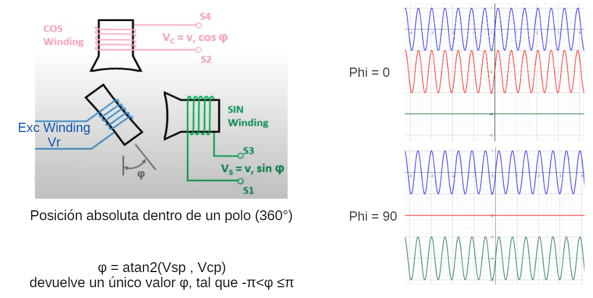
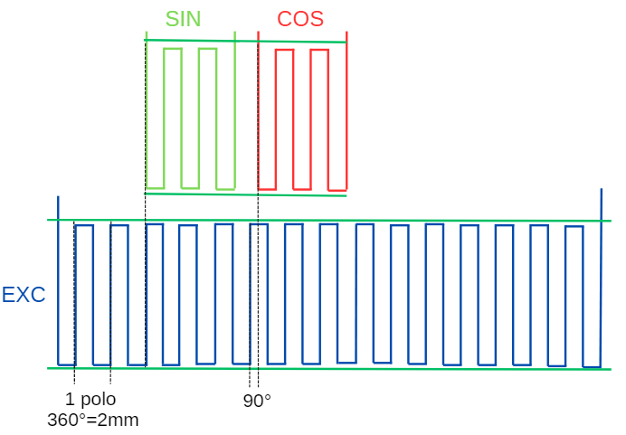
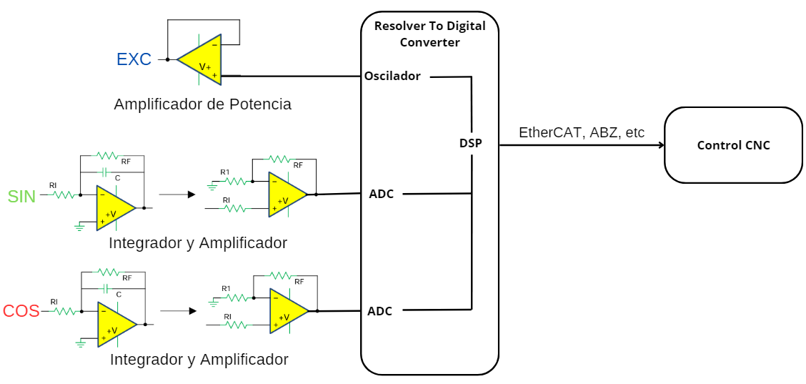
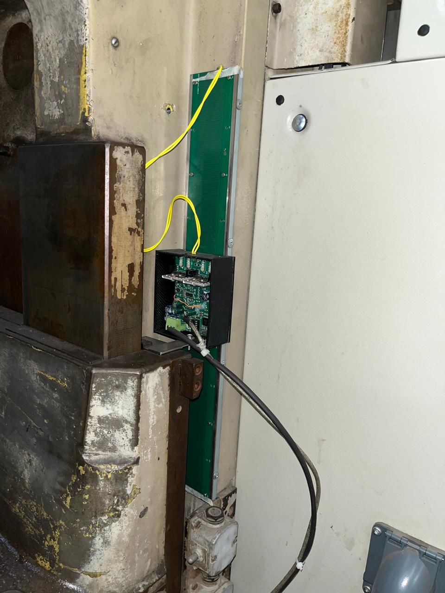

# Inductosyn-Noll-M
Linear resolver using PCBs as coils

Rotary resolvers are used to measure degrees of rotation in a shaft. 
To do so they have an excitation winding (EXC) that rotates with and angle (φ). 
Also they have two stationary windings that are perpendicular to each other, called SIN and COS. 

(For more info:  https://en.wikipedia.org/wiki/Resolver_(electrical) )

Linear resolvers use the same principle but to measure linear of motion. 
The SIN and COS coils are shifted 90°, that is a quarter of a pole length. They can move freely over the EXC coil that is fixed to the machine. 

To power the EXC winding we need a power amplifier very similar to an audio amplifier. 
The SIN and COS signals are of a few mV, so we have to filter and amplfy them.
Then this signals are fed to a AD2S1205 from Analog Devices that is a resolver to digital converter. 
The AD2S gives us the position inside a pole (2mm length), so a microcontroller is used to process this data and send it to the CNC controller.

A prototype of this system has been tested on a Heckert FSS-400 milling machine using Linux CNC as the feedback for the knee.

